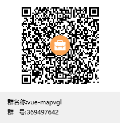

# @vuemap/vue-amap
[](https://www.npmjs.org/package/@vuemap/vue-amap)
[](https://npmjs.org/package/@vuemap/vue-amap)

[](https://gitee.com/guyangyang/vue-amap)
[](https://gitee.com/guyangyang/vue-amap/stargazers)

> @vuemap/vue-amap@next是一套基于Vue3 和高德地图2.0的地图组件。
> 该版本对原vue-amap组件进行升级，主要适配amap2.0相关的接口，同时调整事件绑定形式，调整为使用v-on进行事件绑定。
> 组件中将会对高德可视化组件loca进行封装，同时提供threejs的接口
> 该项目基于 https://github.com/ElemeFE/vue-amap/ 开发

>vue2请使用0.x版本，对应分支vue2

```html
觉得有用可以给个star
```

## 群号


## 捐赠支持


## 安装
```
npm i -S @vuemap/vue-amap@next
```

## 文档
**[https://vue-amap.guyixi.cn](https://vue-amap.guyixi.cn)**


## 快速上手

引入@vuemap/vue-amap@next

```javascript
// 引入vue-amap
import VueAMap, {initAMapApiLoader} from '@vuemap/vue-amap';
import '@vuemap/vue-amap/dist/style.css';

// 初始化vue-amap
initAMapApiLoader({
  // 高德的key
  key: 'YOUR_KEY',
});
createApp(App).use(VueAmap)

```

## 组件

### 地图

```vue
<el-amap  :zoom="zoom" :center="center">
</el-amap>
```

